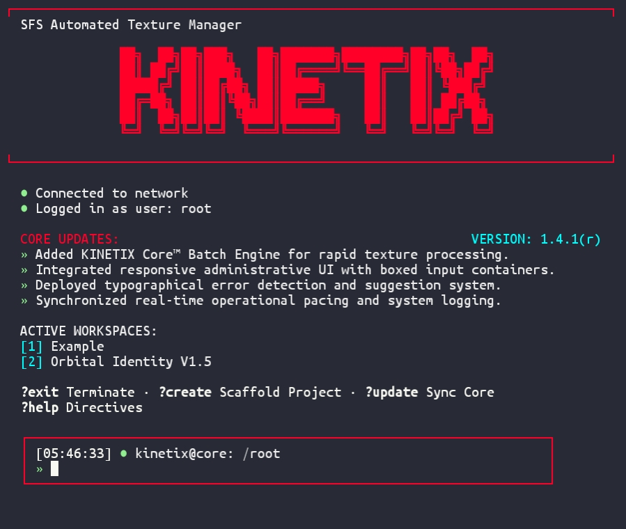
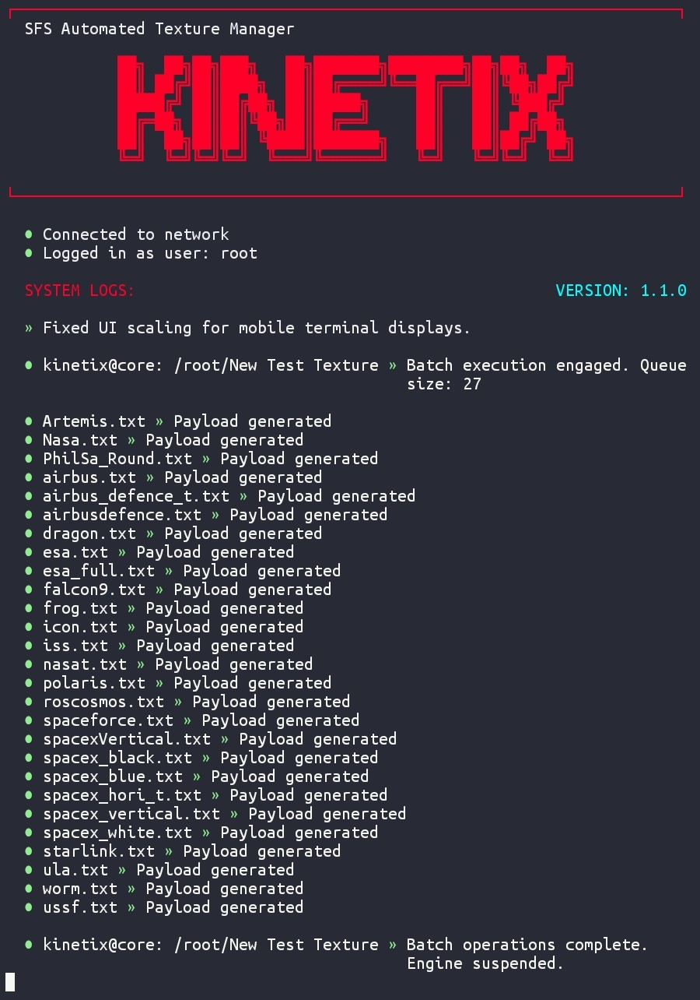
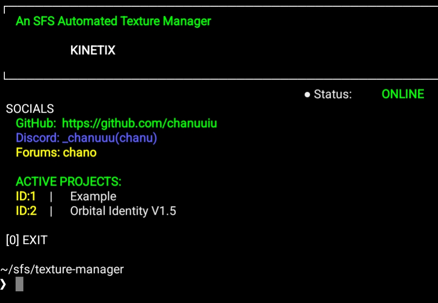

# 🚀 KINETIX Core™ — An Automated SFS Texture Manager V1.4.1(r)

<p align="left">
  
  
  <a href="https://discord.com/invite/hwfWm2d" ></a>
</p>

> **Disclaimer:** Kinetix is a standalone, community-driven script I made out of pure boredom. It is not affiliated with, endorsed by, or connected to Stef Morojna or Spaceflight Simulator. 

Kinetix is an open-source, automated texture manager for SFS. Honestly, doing manual `.txt` configuration for modding is a massive headache, so I wrote this terminal tool to just scan your images and instantly generate the config files for you. It's built with a clean script that works flawlessly on both Termux and Pydroid 3 without you having to mess with the code.

## 🖼️ PREVIEW ON TERMUX — NEW VERSION

<p align="center">
  
  
</p>

## 🖼️ PREVIEW ON PYDROID3 — OLD VERSION
<p align="center">
  
</p>

## 🛠️ Installation

```bash
# Clone the repository
git clone https://github.com/chanuuiu/KINETIX
cd KINETIX
chmod +x core.py

# Run in Termux (it auto-installs what it needs)
python core.py
